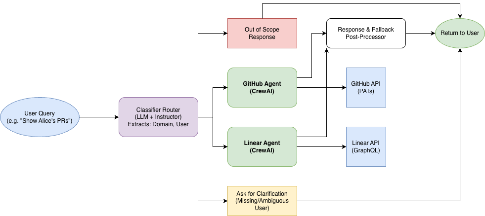

# StackGen AI Multi-Agent System

## What I Built & How It Works

I have built an intelligent multi-agent orchestration system that automatically routes user requests to specialized AI agents. The system utilizes CrewAI for agent execution alongside a small local Large Language Model (`llama3.2:3b` running on Ollama) combined with the `instructor` library for deterministic intent classification. When a user submits a query, an initial routing layer analyzes the language to determine the target domain (GitHub or Linear), identifies any specific users mentioned (e.g., "Alice" or "Bob"), and manages state by requesting clarifications if the query is ambiguous.



Once the domain and users are resolved, the system instantiates either the **GitHub Expert Agent** or the **Linear Expert Agent**. These specialized agents connect to real APIs using the respective user credentials loaded via environment variables. Based on the query, they execute the appropriate tools (fetching repositories, issues, teams, or pull requests) and formulate conversational, natural language responses reflecting real-time data from the external integrations.

---

## Setup & Execution

### Prerequisites
1. **Python 3.13** installed locally.
2. **Docker Desktop** (if you prefer running it containerized).
3. **Ollama** installed locally with the `llama3.2:3b` model pulled (`ollama pull llama3.2:3b`).

### Local Environment Setup

1. **Clone/Navigate** to the project directory.
2. **Create a `.env` file** in the root directory and ensure it has your credentials:
   ```env
   GITHUB_USER1_TOKEN=...
    GITHUB_USER1_USERNAME=...
    GITHUB_USER2_TOKEN=...
    GITHUB_USER2_USERNAME=...
    LINEAR_USER1_TOKEN=...
    LINEAR_USER2_TOKEN=...
    USER1_NAME=Bob
    USER2_NAME=Alice
    # we can add more users by adding more tokens and usernames
    # e.g. 
    # GITHUB_USER3_TOKEN=...
    # GITHUB_USER3_USERNAME=...
    # LINEAR_USER3_TOKEN=...
    # LINEAR_USER3_USERNAME=...
    # USER3_NAME=Charlie
   
   OLLAMA_MODEL=llama3.2:3b
   OLLAMA_BASE_URL=http://localhost:11434
   ```
3. **Create and Activate a Virtual Environment:**
   ```bash
   python3 -m venv venv
   source venv/bin/activate
   ```
4. **Install Requirements:**
   The `requirements.txt` includes core dependencies like `crewai`, `instructor`, and `requests`. Install them via:
   ```bash
   pip install -r requirements.txt
   ```
5. **Run the System:**
   You can run it as an interactive CLI or execute a single query safely:
   ```bash
   # Start the interactive loop
   python src/main.py

   # Single query execution
   python src/main.py "Show me Alice's open pull requests"
   ```

### Docker Execution
To run via Docker (configured to utilize the host's Ollama instance for Metal/GPU acceleration):
```bash
docker compose up --build
# To execute a query inside the container
docker compose run --rm agent "What issues are assigned to Bob in Linear?"
```

---

## Assumptions & Limitations

1. **LLM Execution Speed Limitations:** While the system runs effectively, interactions executed solely within CPU-bound Docker environments can be notably slower compared to native execution using Apple Silicon optimization via macOS's native Ollama service. The current `docker-compose` setup attempts to bridge this by mapping queries back to the host machine's Ollama instance.
2. **Routing Robustness:** The `llama3.2:3b` model is highly parameter-efficient but can sometimes struggle with consistent JSON parsing required by CrewAI and `instructor`. To combat this, a robust fallback parser exists inside `orchestrator.py` that utilizes pure keyword detection to identify intent natively avoiding application collapse during hallucinations. CrewAI might still randomly fallback and dump JSON payloads rather than processing conversational output.
3. **Implicit Tool Scoping:** The agents assume that their scope of permissions matches what the provided API tokens represent. The tools dynamically fetch whichever tokens the routing mechanism decides correlate with the queried user but are limited strictly to the 10 most recent records per query to manage rate-limit boundaries quickly.
4. **Clarification Boundaries:** The system operates exactly based on defined users. Queries about users whose aliases were not hard-coded in the primary `.env` maps are naturally deemed ambiguous and require system clarification.
